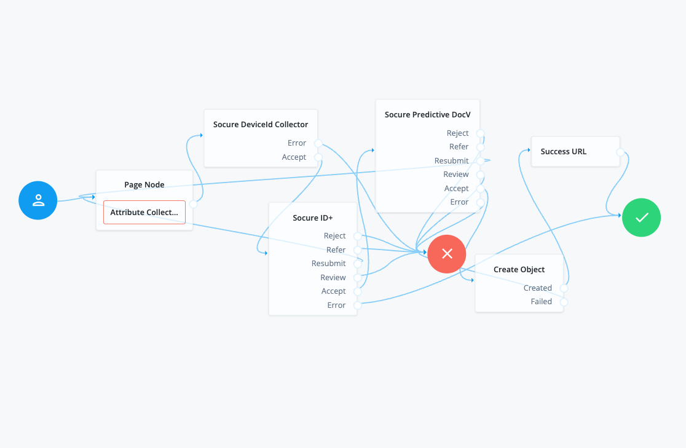
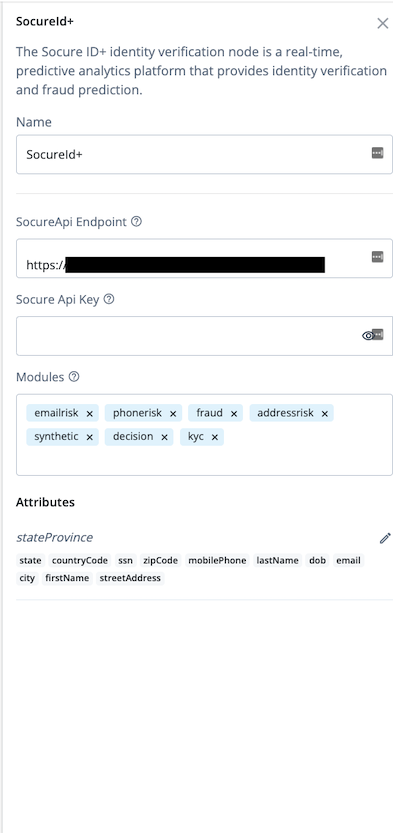
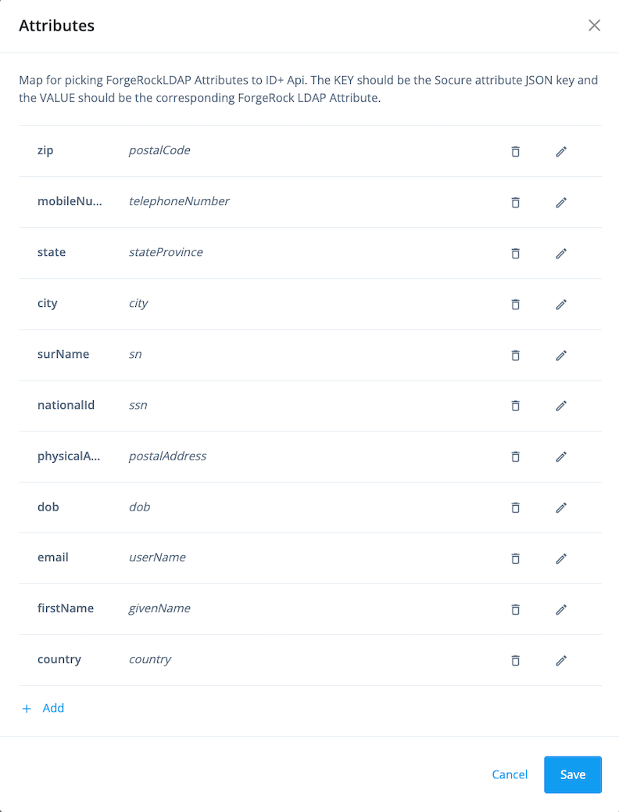
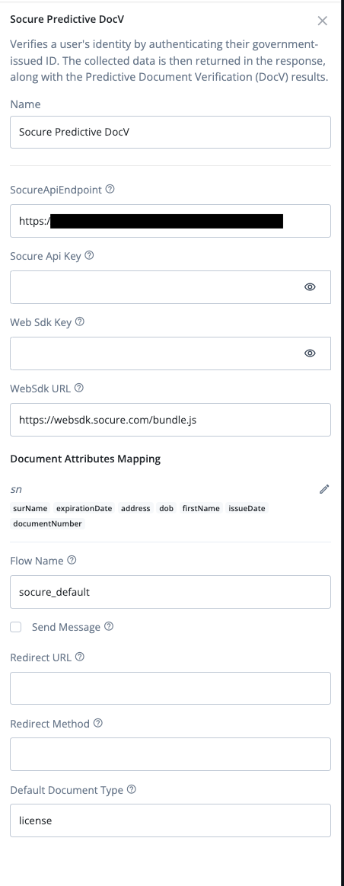
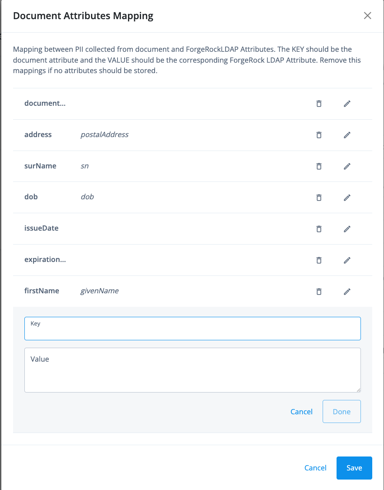
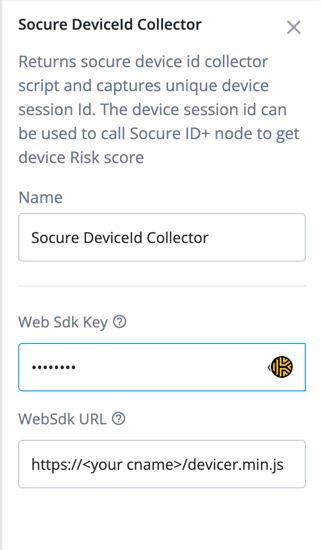

<!--
 * The contents of this file are subject to the terms of the Common Development and
 * Distribution License (the License). You may not use this file except in compliance with the
 * License.
 *
 * You can obtain a copy of the License at legal/CDDLv1.0.txt. See the License for the
 * specific language governing permission and limitations under the License.
 *
 * When distributing Covered Software, include this CDDL Header Notice in each file and include
 * the License file at legal/CDDLv1.0.txt. If applicable, add the following below the CDDL
 * Header, with the fields enclosed by brackets [] replaced by your own identifying
 * information: "Portions copyright [year] [name of copyright owner]".
 *
 * Copyright 2022 ForgeRock AS.
-->

# Socure ID+ Identity Verification Nodes

Learn how to install and configure the Socure ID+ Identify Verification nodes for ForgeRock's [Identity Platform](forgerock_platform) 7.2.0 and later. 

## Overview 

Socure’s revolutionary ID+ Platform utilizes every element of identity, natively orchestrated by advanced AI and ML, to maximize accuracy, reduce false positives, and eliminate the need for disparate products. 

After you complete the build and configuration process with ForgeRock, the following three nodes will be available:

1. **SocureId+ Node**: Verifies the collected user attributes using Socure's ID+ API and returns a decision for the user identity.
2. **Socure Predictive Docv Node**: Verifies a user's identity by authenticating their government-issued ID. The collected data is then returned in the response, along with the Predictive Document Verification (DocV) results. 
3. **Socure DeviceId collector Node** : Collects device information. The information is used in Socure ID+ node to assess device risk.

To use all or a subset of these nodes, you have to open an account with Socure and provision the account with the right risk and fraud analysis modules to support your use cases.  The Decision module is required for proper operations of the nodes. Contact Socure for more information.

## Installation 

1. Copy the `.jar` file from the `../target` directory to the `../web-container/webapps/openam/WEB-INF/lib` directory where AM is deployed. 
2. Restart the web container for the new node to become available. The node will then appear in the Authentication Tree components palette.

## Use cases

The Socure integration with ForgeRock supports both identity verification and identity proofing using the workflows in the sections below. 

### Use case: SocureId+ Authentication node

To verify a user's identity with the Socure's ID+ API, your Authentication Tree should be configured as follows: 

1. The Page Node gathers the attributes required to verify the user identity. 
2. The SocureId+ node verifies the identity using the ID+ API and returns a simple decision outcome (reject, refer, resubmit, review, or accept) for the user identity. 
    - If the decision is accept, the Create Object creates a resource with the information gathered by the previous nodes. The user is then automatically logged in after their identity is verified and the flow is successful. 
    - If the decision is refer, the Socure Predictive DocV node can be initiated for a step up in authentication. See **Use case: Socure's Predictive Docv Node** below for more information. 

### Use case: Socure Predictive Docv Node

In use cases that require a step up in authentication, Socure Predictive DocV node can be used as an additional authentication source to authenticate the user's ID and verify their, then recommend if they should be accepted or rejected.

When implementing Socure's Predictive DocV node, your Authentication Tree should be configured as follows: 

1. The Page Node gathers the attributes required to verify the user identity. 
2. The SocureId+ node verifies the identity using the ID+ API and returns a simple decision outcome (reject, refer, resubmit, review, or accept) for the user identity. 
3. If the decision is refer, the SocureId+ node will initiate a step up authentication workflow using the Socure Predictive Document Verification (DocV) node and the DocV Web SDK. 
4. The user follows the instructions in the DocV workflow to authenticate their government-issued ID and verify their identity. After the flow completes successfully, the Create Object will create a resource with the information gathered by the previous nodes. The user is then automatically logged in after their identity is verified and the flow is successful.

## Configuration

The code in this repository has binary dependencies that live in the ForgeRock Maven repository. Maven can be configured to authenticate to this repository by following the steps in the [ForgeRock Knowledge Base Article](https://backstage.forgerock.com/knowledge/kb/article/a74096897).

### Prerequisites

Before completing the configuration steps in the sections below, you will need to create a Socure account to retrieve your API key. 

#### Create an account

1. Go to [Admin Dashboard](dashboard.socure.com).
2. Click **Create Account**.
3. Enter the requested information in the fields provided.
4. Click **Submit**. 

New accounts must be approved by Socure. Once approved, you will receive an email with a link to set your account password. The link will expire after 7 days.

#### Configure your account

1. Log in to [Admin Dashboard](dashboard.socure.com).
2. On the **Account/Environment** menu, select **Production**, **Certification**, or **Sandbox**.
3. Go to **Developers > IPs & Domains**, then click **API Access**.
4. Click **New Domain**, then enter the IP address or domain in the **IP/Domains** field.
5. Click **Create**.

#### Retrieve your API Key

1. Log in to [Admin Dashboard](dashboard.socure.com).
2. Select an environment from the **Account/Environment** menu on the upper-right corner of the page.
3. Go to **Developers > ID+ Keys**, then click the vertical ellipsis and select **Copy Key**.

Socure provides a set of API keys for the Sandbox, Certification, and Production environments. Users must have the correct permissions enabled for their account to access their keys.

### Configure SocureId+ Node

Verifies the collected user attributes using Socure's ID+ API and returns a decision for the user identity.

| Configuration     | Description                                                                                                                                                   | Example                                                                                             |
|-------------------|---------------------------------------------------------------------------------------------------------------------------------------------------------------|-----------------------------------------------------------------------------------------------------|
| Name              | A name for the node.                                                                                                                                          | SocureId+ Node                                                                                      |
| SocureAPIEndpoint | The API URL path.                                                                                                                                             | Api Endpoint retrieved from https://developer.socure.com/                                                   |
| SocureAPIKey      | Your API key for the environment you want to access. You can find your SDK key in Admin Dashboard.                                                            | SocureApiKey a1b234cd-xxxx-xxxx-xxxx-56abcdef6789                                                   |
| modules           | A configurable list of ID+ modules that are called in the ID+ API call. Socure ID+ API docs provides more detail about modules. https://developer.socure.com/reference#tag/ID+                                                                                      | emailrisk, phonerisk, fraud, addressrisk, synthetic, decision, kyc                                  |
| attributes        | Maps ForgeRockLDAP Attributes to ID+ API. The KEY should be the Socure attribute JSON key and the VALUE should be the corresponding ForgeRock LDAP Attribute. | streetAddress, city, zipCode, countryCode, email, ssn, lastName, dob, firstName, mobilePhone, state |

### SocureId+ Node output

The Decision module's recommendations are determined by Decision Logic, a configurable set of rules that automatically runs when you include the Decision module in a transaction.

Decision Logic receives each module's transaction results as inputs, then filters the data through a series of conditional statements that check for the presence or absence of specific reason codes or scores. If a transaction's results match the specific criteria in the logic, the decision engine will automatically output one of the following the decision outcomes:

| Output |  Description |
| --- | ---| 
| Reject            | Decline the consumer.  |
| Refer             | Refer to the Predictive Document Verification (DocV) module to verify the consumer using  government-issued documents. |
| Resubmit          | Resubmit the consumer information with a residential address. |
| Review            | Manually review the consumer information. |
| Accept            | The consumer is verified and accepted. |

### Configure Socure Predictive Docv node

Verifies a user's identity by authetnicating their government-issued ID. The collected data is then returned in the response, along with the Predictive Document Verification (DocV) results. 

| Configuration             | Description                                                                                        | Example                                           |
|-------------------|----------------------------------------------------------------------------------------------------|---------------------------------------------------|
| Name              | A name for the node.                                                                               | Socure Predictive DocV                            |
| SocureAPIEndpoint | The API URL path.                                                                                  | Api Endpoint retrieved from https://developer.socure.com/ |
| SocureAPIKey      | Your API key for the environment you want to access. You can find your SDK key in Admin Dashboard. | SocureApiKey a1b234cd-xxxx-xxxx-xxxx-56abcdef6789 |
| Document Attributes Mapping| Mapping between PII collected from document and ForgeRockLDAP Attributes. The KEY should be the document attribute and the VALUE should be the corresponding ForgeRock LDAP Attribute. Remove this mappings if no attributes should be stored.                                       | documentNumber = docNumber                                              |
| websdkUrl         | The URL for the latest version of the DocV Web SDK.                                                | https://websdk.socure.com/bundle.js               |
| flow| Deploys a customized Capture App workflow | socure_default|
|sendMessage | Controls the SMS send behavior of the Web SDK plugin. By default, this setting uses the Socure SMS delivery. If you prefer to use a different method, set the value to false. | true
|redirect|Optional URL settings that redirect the consumer after the document capture and upload process is canceled or completed on the Capture App.| https://acme.com/success
|redirectMethod|Redirect Method for Redirect URL.|GET or POST
|defaultDocumentType|Enables a simplified Capture App flow and allows you to select a default document type for the transaction|license

### Socure Predictive Docv node output

The Decision module's recommendations are determined by Decision Logic, a configurable set of rules that automatically runs when you include the Decision module in a transaction.

Decision Logic receives each module's transaction results as inputs, then filters the data through a series of conditional statements that check for the presence or absence of specific reason codes or scores. If a transaction's results match the specific criteria in the logic, the decision engine will automatically output one of the following the decision outcomes:

| Output |  Description |
| --- | ---| 
| Reject            | Decline the consumer.  |
| Refer             | Refer to the Predictive Document Verification (DocV) module to verify the consumer using  government-issued documents. |
| Resubmit          | Resubmit the consumer information with a residential address. |
| Review            | Manually review the consumer information. |
| Accept            | The consumer is verified and accepted. |

### Configure Socure deviceID Collector node

The Device Risk Node collects device information using Java Script. The information that the node collects is used by the Socure ID+ Node to assess device risk.

| Configuration             | Description                                                                                        | Example                                           |
|-------------------|----------------------------------------------------------------------------------------------------|---------------------------------------------------|
| Name              | A name for the node.                                                                               | Socure DeviceId collector                            |
| websdkKey | The websdk key to load java script library. The library generate the deviceId that should be used to as an input to ID+ node                                                                |a1b234cd-xxxx-xxxx-xxxx-56abcdef6789 | 
| websdkUrl         | The URL for the latest version of the Device Risk Web SDK.                                                | https://<your-cname- alias>/device-risk-sdk.js

### Socure DeviceID collector node output

| Output |  Description |
| --- | ---| 
| Error            | Internal Error while collecting the deviceId  |
 Accept    | DeviceId capture successfully |