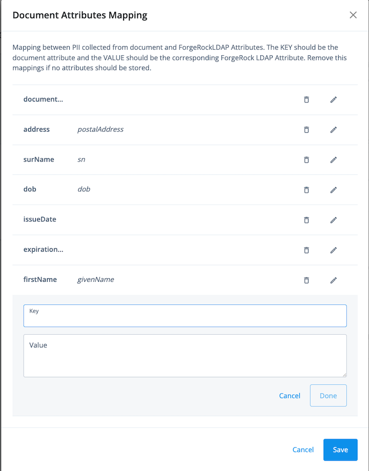

<!--
 * The contents of this file are subject to the terms of the Common Development and
 * Distribution License (the License). You may not use this file except in compliance with the
 * License.
 *
 * You can obtain a copy of the License at legal/CDDLv1.0.txt. See the License for the
 * specific language governing permission and limitations under the License.
 *
 * When distributing Covered Software, include this CDDL Header Notice in each file and include
 * the License file at legal/CDDLv1.0.txt. If applicable, add the following below the CDDL
 * Header, with the fields enclosed by brackets [] replaced by your own identifying
 * information: "Portions copyright [year] [name of copyright owner]".
 *
 * Copyright 2022 ForgeRock AS.
-->

# Socure ID+ Nodes for ForgeRock

Socure’s ID+ Platform is the leading solution for digital identity verification and trust. Its predictive analytics combine artificial intelligence (AI) and machine learning (ML) techniques with trusted online/offline data intelligence from physical government-issued identity documents, as well as email, phone, address, IP, device, velocity, date of birth, SSN, and the broader internet to verify identities in real time. It is the only solution that analyzes and correlates every facet of an individual’s digital identity to accurately verify their identity while simultaneously detecting and preventing fraud.

## The Socure Nodes Overview 

The Socure Nodes embed Socure’s ID+ identity and Predictive Document Verification (DocV) services into your ForgeRock org user onboarding workflow, allowing you to enroll verified users in multi-factor authentication (MFA) with ForgeRock and add Single Sign On (SSO) to your application via ForgeRock.

Socure provides the following three ForgeRock nodes:

1. **Socure ID+ Node:** Verifies the collected user attributes using Socure's ID+ API and returns a decision for the user identity.
2. **Socure DeviceID Collector Node:** collects device data and creates a device identifier. The device identifier can be included in ID+ API for fraud and risk analysis.
3. **Socure Predictive DocV Node:** Verifies a user's identity by authenticating their government-issued ID. The collected data is then returned in the response, along with the DocV results.

To use all or a subset of these nodes, you have to open an account with Socure and provision the account with the right risk and fraud analysis modules to support your use cases.  The Decision module is required for proper operations of the nodes. Contact Socure for more information

##How it works​
The Socure ID+ Node makes outbound calls from your ForgeRock org to the ID+ Platform. When you need to verify a user’s identity during your onboarding workflow or during a user profile update, the Socure ID+ Node triggers an outbound call to the ID+ Platform to verify the user’s Personal Identifiable Information (PII), then receives the ID+ verification results in the response.

The Socure DeviceID Collector Node can be used in conjunction with ID+ Node to collect device fingerprint data and send the data to ID+ for device risk assessment.

If ID+ is able to verify the identity, the user will be able to continue with the onboarding or profile update workflow. If ID+ cannot verify the identity, the user will be unable to continue. The Socure Predictive DocV Node then loads the DocV Web SDK to initiate the document verification process, and after completing the verification, the document data and results are returned to the ForgeRock process to make the final decision.

###NOTE
To integrate your Socure account with the Socure ID+ Node, you must have a ForgeRock Identity Platform instance or a ForgeRock Identity Cloud account and a Socure Admin Dashboard account.
##Use cases
The Socure integration with ForgeRock supports identity proofing during the initial onboarding of a user using the Journey shown below.

##Socure ID+ Node
To verify a user's identity with the Socure's ID+ API, your Authentication Tree should be configured as follows:

* The Page Node gathers the user attributes (such as name , email, address, phone , DOB) required to verify the user identity.
T2. The Socure ID+ node verifies the identity using the ID+ API and returns a simple decision outcome (reject, refer, resubmit, review, or accept) for the user identity.
   - If the decision is “accept”, the Create Object creates a resource with the information gathered by the previous nodes. The user is then automatically logged in after their identity is verified and the flow is successful.
   - If the decision is “refer”, the Socure Predictive DocV node can be initiated for a step up in authentication. See Use case: Socure's Predictive DocV Node below for more information.
##Socure DeviceId Collector Node

The DeviceId Collector Node collects device data and creates device and statistical identifiers. With the additional PII received in ID+ API calls, Socure links device data to personal identity attributes for fraud and risk analysis.

The node executes client-side JavaScript code and sets captured device identifiers in Forgerock shared state. The Socure ID+ node utilizes the device identifiers stored in the shared state as input to ID+ API, along with other PII available at that moment, to retrieve available device intelligence.
##Socure Predictive DocV Node
In use cases that require a step up in authentication, reset password, or initial onboarding, the Socure Predictive DocV node can be used as an additional authentication source to authenticate the user's ID (driver’s license/passport) and verify their identity, then recommend if they should be accepted or rejected.

When implementing Socure's Predictive DocV node, your Authentication Tree should be configured as follows:

1. The Page Node gathers the attributes required to verify the user identity.
2. The Socure ID+ node verifies the identity using the ID+ API and returns a simple decision outcome (reject, refer, resubmit, review, or accept) for the user identity.
3. If the decision is “refer”, the Socure ID+ node will initiate a step up authentication workflow using the Socure Predictive Document Verification (DocV) node and the DocV Web SDK.
4. The user follows the instructions in the DocV workflow to authenticate their government-issued ID and verify their identity. After the flow completes successfully, the Create Object will create a resource with the information gathered by the previous nodes or information collected from government issued ID. The user is then automatically logged in after their identity is verified and the flow is successful.

##Integrate with the Socure Nodes​
You can integrate your Socure account with the Socure Nodes by completing the steps in the sections below.

Access your account settings in Admin Dashboard​

1. Login to Admin Dashboard. If you do not have an Admin Dashboard account, see Socure ID+ Quick Start Guide.
2. Go to the Developers > ID+ Keys page and copy your API keys for the Production environment.
3. Go to the Developers > IPs & Domains page and add the the following IP address to the Domain Name list:
<Your ForgeRock account CIDR range>

##Installation
If you are using the ForgeRock Identity Platform, follow these instructions below to install the Socure ID+ Nodes.

1. Download the latest version of the Socure Nodes jar file from the ForgeRock marketplace https://github.com/ForgeRock/socure-idplus-node/releases
to your  ../web-container/webapps/openam/WEB-INF/lib directory where AM is deployed.
2. Restart the web container for the new node to become available. The node will then appear in the Authentication Tree components palette.
3. Configure your integration in the ForgeRock Platform Portal.
4. Create a new journey or open an existing journey.
5. Search for Socure Node in the journey editor window. Two Socure nodes will appear under the marketplace network.
6. Drag the nodes to the journey and complete the configuration.

If you are using the ForgeRock Identity Cloud, follow the instructions below to install the Socure ID+ Nodes.

1. Search for Socure Nodes in the Journey Builder. Two Socure nodes will appear under the marketplace network.
2. Drag and drop the the Socure Nodes and configure them.

##Configuring Socure ID+ Node

The ID+ Node verifies the collected user attributes using Socure's ID+ API and returns a decision for the user identity verification process. The node requires user attributes based on modules that need to be executed in ID+. More information about required attributes per modules can be found on developer.socure.com.

| Configuration     | Description                                                                                                                                                   | Example                                                                                             |
|-------------------|---------------------------------------------------------------------------------------------------------------------------------------------------------------|-----------------------------------------------------------------------------------------------------|
| Name              | A name for the node.                                                                                                                                          | SocureId+ Node                                                                                      |
| SocureAPIEndpoint | The API URL path.                                                                                                                                             | Api Endpoint retrieved from https://developer.socure.com/                                                   |
| SocureAPIKey      | Your API key for the environment you want to access. You can find your SDK key in Admin Dashboard.                                                            | SocureApiKey a1b234cd-xxxx-xxxx-xxxx-56abcdef6789                                                   |
| modules           | A configurable list of ID+ modules that are called in the ID+ API call. Socure ID+ API docs provides more detail about modules. https://developer.socure.com/reference#tag/ID+                                                                                      | emailrisk, phonerisk, fraud, addressrisk, synthetic, decision, kyc                                  |
| attributes        | Maps ForgeRockLDAP Attributes to ID+ API. The KEY should be the Socure attribute JSON key and the VALUE should be the corresponding ForgeRock LDAP Attribute. | streetAddress, city, zipCode, countryCode, email, ssn, lastName, dob, firstName, mobilePhone, state |

### Socure ID+ Node output

The Decision module's recommendations are determined by Decision Logic*, a configurable set of rules that automatically runs when you include the Decision module in a transaction.

Decision Logic receives each module's transaction results as inputs, then filters the data through a series of conditional statements that check for the presence or absence of specific reason codes or scores. If a transaction's results match the specific criteria in the logic, the decision engine will automatically output one of the following the decision outcomes:

| Output |  Description |
| --- | ---| 
| Reject            | Decline the consumer.  |
| Refer             | Refer to the Predictive Document Verification (DocV) module to verify the consumer using  government-issued documents. |
| Resubmit          | Resubmit the consumer information with a residential address. |
| Review            | Manually review the consumer information. |
| Accept            | The consumer is verified and accepted. |

### Configure Socure deviceID Collector node

The Device Risk Node collects device information using Java Script. The information that the node collects is used by the Socure ID+ Node to assess device risk.

| Configuration             | Description                                                                                        | Example                                           |
|-------------------|----------------------------------------------------------------------------------------------------|---------------------------------------------------|
| Name              | A name for the node.                                                                               | Socure DeviceId collector                            |
| websdkKey | The websdk key to load java script library. The library generate the deviceId that should be used to as an input to ID+ node                                                                |a1b234cd-xxxx-xxxx-xxxx-56abcdef6789 | 
| websdkUrl         | The URL for the latest version of the Device Risk Web SDK.                                                | https://<your-cname- alias>/device-risk-sdk.js

### Socure DeviceId collector node output

| Output |  Description |
| --- | ---| 
| Error            | Internal Error while collecting the deviceId  |
Accept    | DeviceId capture successfully |

### Configure Socure Predictive Docv node

The Predictive DocV Node Verifies a user's identity by authenticating their government-issued ID. The collected data is then returned in the response, along with the Predictive Document Verification (DocV) results. The node can set document attributes to the user profile.  Document Data contains physical address, name and date of birth. This node always runs device Risk with a document verification process.

| Configuration             | Description                                                                                        | Example                                           |
|-------------------|----------------------------------------------------------------------------------------------------|---------------------------------------------------|
| Name              | A name for the node.                                                                               | Socure Predictive DocV                            |
| SocureAPIEndpoint | The API URL path.                                                                                  | Api Endpoint retrieved from https://developer.socure.com/ |
| SocureAPIKey      | Your API key for the environment you want to access. You can find your SDK key in Admin Dashboard. | SocureApiKey a1b234cd-xxxx-xxxx-xxxx-56abcdef6789 |
| Document Attributes Mapping| Mapping between PII collected from document and ForgeRockLDAP Attributes. The KEY should be the document attribute and the VALUE should be the corresponding ForgeRock LDAP Attribute. Remove this mappings if no attributes should be stored.                                       | documentNumber = docNumber                                              |
| websdkUrl         | The URL for the latest version of the DocV Web SDK.                                                | https://websdk.socure.com/bundle.js               |
| flow| Deploys a customized Capture App workflow | socure_default|
|sendMessage | Controls the SMS send behavior of the Web SDK plugin. By default, this setting uses the Socure SMS delivery. If you prefer to use a different method, set the value to false. | true
|redirect|Optional URL settings that redirect the consumer after the document capture and upload process is canceled or completed on the Capture App.| https://acme.com/success
|redirectMethod|Redirect Method for Redirect URL.|GET or POST
|defaultDocumentType|Enables a simplified Capture App flow and allows you to select a default document type for the transaction|license

### Socure Predictive Docv node output

The Decision module's recommendations are determined by Decision Logic, a configurable set of rules that automatically runs when you include the Decision module in a transaction.

Decision Logic receives each module's transaction results as inputs, then filters the data through a series of conditional statements that check for the presence or absence of specific reason codes or scores. If a transaction's results match the specific criteria in the logic, the decision engine will automatically output one of the following the decision outcomes:

| Output |  Description |
| --- | ---| 
| Reject            | Decline the consumer.  |
| Refer             | Refer to the Predictive Document Verification (DocV) module to verify the consumer using  government-issued documents. |
| Resubmit          | Resubmit the consumer information with a residential address. |
| Review            | Manually review the consumer information. |
| Accept            | The consumer is verified and accepted. |

